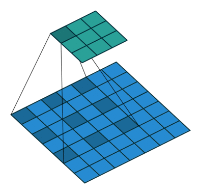

# DeepLab 系列总结（V1 → V3+）

> 整理自与 Reasonix 的对话记录
> DeepLab 是 Google 提出的语义分割模型系列，核心贡献是**空洞卷积（Atrous/Dilated Convolution）**和 **ASPP（Atrous Spatial Pyramid Pooling）**。

---

## 一、DeepLab V1（2015）

### 要解决的问题

语义分割的三大困境：

1. **连续池化/步长卷积** → 分辨率下降，丢失细节
2. **多尺度目标** → 大目标和小目标需要不同感受野
3. **分类器的平移不变性** → 分割需要精确位置，分类只需"有没有"

### 核心创新

#### 1. 空洞卷积（Atrous/Dilated Convolution）

这是 DeepLab 最本质的贡献，后续所有版本都建立在这个基础上。

**传统卷积的局限**：
```text
标准 3×3 卷积，stride=1，padding=1：
输入 4×4 → 输出 4×4（分辨率不变，但感受野只有 3×3）
```

**空洞卷积的改进**：
```text
空洞率（rate）= 2 的 3×3 卷积：
卷积核相邻元素之间插入 rate-1 个空洞
实际感受野 = 3 + 2×(rate-1) = 5×5
但参数量不变！还是 9 个参数
```

**数学定义**：
```text
标准卷积：    y[i] = Σ_k x[i + k] · w[k]
空洞卷积：    y[i] = Σ_k x[i + rate·k] · w[k]

rate=1 → 标准卷积
rate=2 → 间隔取点，感受野扩大一倍
rate=4 → 间隔更大，感受野更大
```


<small>*Dumoulin & Visin 的卷积运算动画，展示 dilated convolution 如何在标准 3×3 卷积核的元素之间插入空洞，扩大感受野。蓝色为输入，青色为输出。*</small>

**在 VGG16 上的应用**：

原始 VGG16 的最后两个 MaxPool 去掉了下采样（stride=1），后续卷积用 rate=2 代替原始 stride=2 的卷积。效果：
- 特征图分辨率从 1/32 提升到 1/8
- 感受野仍保持（不丢失语义信息）
- 不引入额外参数

#### 2. 条件随机场（CRF，Conditional Random Field）

**为什么需要 CRF？** DCNN 的输出有空间平滑性不足的问题——分割结果边界模糊、有杂散的点。

**CRF 的作用**：作为后处理，用图模型优化分割结果。
```
未加 CRF 前：       │ 加 CRF 后：
  像素级独立预测     │   相邻像素互相约束
  边界模糊          │   边界对齐到真实边缘
  有孤立噪点        │   空间一致性
```

**CRF 的能量函数**：
```
E(x) = Σ_i θ_i(x_i) + Σ_ij θ_ij(x_i, x_j)

一元项 θ_i：将像素 i 分类为 x_i 的代价（来自 DCNN 的输出概率）
二元项 θ_ij：相邻像素的平滑性约束
```

V1 的 CRF 是**全连接 CRF（Dense CRF）**——所有像素两两之间都有连接，而不是只在相邻像素之间。

### V1 贡献总结
```
空洞卷积  → 在不损失感受野的前提下保持高分辨率特征图
CRF后处理 → 精细化边界，分割更锐利
```

---

## 二、DeepLab V2（2017）

### 相比 V1 的改进
```
V1: VGG16 + 空洞卷积 + CRF
V2: ResNet101 + ASPP + CRF（CRF 仍然保留）
```

### 核心新贡献：ASPP（Atrous Spatial Pyramid Pooling）

**动机**：不同大小的目标需要不同尺度的特征。
- 大目标 → 需要大感受野（高空洞率）
- 小目标 → 需要小感受野（低空洞率）

**ASPP 的设计**：
```
输入特征图
    │
    ├── Conv 1×1（rate=1）              → 感受野 3×3
    ├── Conv 3×3（rate=6）              → 感受野 13×13
    ├── Conv 3×3（rate=12）             → 感受野 25×25
    ├── Conv 3×3（rate=18）             → 感受野 37×37
    └── Image Pooling（全局平均池化）    → 整图感受野
                                                   
所有分支的输出拼接到一起 → 多尺度特征融合
```

**V2 中 ASPP 的具体结构**：
```
ASPP(
  branch1: Conv2D(1×1, 256)
  branch2: Conv2D(3×3, 256, rate=6, padding=6)
  branch3: Conv2D(3×3, 256, rate=12, padding=12)
  branch4: Conv2D(3×3, 256, rate=18, padding=18)
  branch5: GlobalAvgPool → Conv2D(1×1, 256) → Upsample
)
↓
Concat（5个分支拼接）
↓
Conv2D(1×1, 256) → 最终分割输出
```

**另外一个改进：Backbone 从 VGG16 → ResNet101**
```
VGG16：
  参数量大（138M）
  感受野增长慢（需要更多层）

ResNet101：
  参数量更少（44M，但层数更深）
  残差连接解决梯度消失
  更好的特征提取能力
```

### V2 贡献总结
```
ASPP    → 多尺度感受野处理多尺度目标
ResNet  → 更强的 backbone
CRF 仍然保留 → 仍未完全解决边界问题
```

---

## 三、DeepLab V3（2017，同年改进版）

### 相比 V2 的改进
```
V2: ResNet101 + ASPP + CRF
V3: ResNet101 + 增强版 ASPP + 去掉 CRF
```

### 核心变化 1：增强版 ASPP

V3 发现 V2 的 ASPP 有个问题——当空洞率很大时，3×3 卷积的核中间区域几乎全是 0，退化成 1×1 卷积：

```
空洞率过大问题：
rate=18 的 3×3 卷积：
  有效参数集中在边缘，中心区域都是空洞
  实际变成了一个稀疏采样，失去了 3×3 的局部建模能力
```

**V3 的解决方案**：

1. **增加 Batch Normalization**：ASPP 各分支后面都加了 BN，训练更稳定。
2. **调整 ASPP 的空洞率组合**：rate = [6, 12, 18]（ResNet101）或 [12, 24, 36]（ResNet50）
3. **加入全局平均池化分支的增强**：
```
V2: GlobalAvgPool → Conv1×1 → Upsample（简单上采样）
V3: GlobalAvgPool → Conv1×1(256) → BN → ReLU → BilinearUpsample
    增加了 BN 和 ReLU，特征表达能力更强
```

### 核心变化 2：去掉了 CRF

**为什么 V3 去掉了 CRF？**
```
CRF 虽然能改善边界，但有明显缺点：
  1. 后处理 → 需要额外计算，不是 end-to-end
  2. 手工设计的能量函数 → 不是学出来的
  3. 全连接 CRF 计算量大 → 推理慢
  4. 提升有限 → 实验发现 CRF 带来的 mIoU 提升不到 1%

V3 认为：改好网络结构本身就能达到 CRF 的边界效果
  → 空洞卷积保持高分辨率特征图
  → 更好的多尺度融合
  → 不需要 CRF 后处理
```

### 核心变化 3：多尺度策略的探索

V3 在论文中实验了两种多尺度策略：

**策略 A：级联（Cascade）**
```
输入 → Block1 → Block2 → Block3 → Block4
                         ↓ rate↑  ↓ rate↑
             各层空洞率逐级增大，感受野不断扩大
```

**策略 B：ASPP 并行**（V3 最终采用的方案）

### V3 贡献总结
```
增强版 ASPP（+BN）→ 多尺度能力提升
去掉 CRF        → 端到端训练，推理加速
级联实验        → 为 V3+ 的多尺度提供了理论依据
```

---

## 四、DeepLab V3+（2018）

### 相比 V3 的改进
```
V3: ResNet101 + ASPP（只用编码器，单尺度输出）
V3+: Xception + ASPP + Decoder（编码器-解码器结构）
```

### 核心新贡献 1：Encoder-Decoder 结构

**V3 的问题**：经过 ASPP 后，直接上采样 8 倍/16 倍到原图大小输出——**底层细节已经丢失了**。

**V3+ 的解决**：
```
V3+ 结构（Encoder-Decoder）：

Encoder（编码器）：
  输入 → Backbone（带空洞卷积）→ ASPP → 高层语义特征（1/16分辨率）
  
Decoder（解码器）：
  高层特征上采样 4 倍
  ↓
  与 Backbone 中层的低层特征（1/4分辨率）拼接
  ↓
  两层 Conv3×3 融合
  ↓
  上采样 4 倍到原图大小 → 输出分割结果
```

为什么用 1/4 分辨率的特征？
```
1/2 → 太浅，特征不够语义化，接近原始像素
1/4 → 刚好：既保留了边缘细节，又有一定的语义
1/8 → 太深，已经下采样了 3 次，边界信息损失较多
```

对比 V3 和 V3+ 的输出路径：
```
V3:
  Encoder → 8×Upsample → 输出
  
V3+:
  Encoder → 4×Upsample → 拼接低层特征 → 2层Conv → 4×Upsample → 输出

V3+ 多了 2 次上采样和 1 次跳连，边界精度大幅提升
```

### 核心新贡献 2：Backbone 改为 Xception

**为什么换 Backbone？**
```
ResNet 的问题：
  标准 ResNet 中的下采样操作（stride=2）会降低分辨率
  即使改造了空洞卷积，深层特征图仍然较小

Xception 的优势：
  深度可分离卷积（Depthwise Separable Convolution）
  → 参数量更少，计算更快
  → 同样 FLOPs 下可以堆更多层
  → 特征提取能力更强
```

**Xception 的改进（Aligned Xception，为分割做了适配）**：
```
1. 深度可分离卷积全部替换标准卷积
   标准卷积：参数量 = in_ch × out_ch × k × k
   深度可分离：参数量 = in_ch × k × k + in_ch × out_ch × 1 × 1
              ≈ 缩减到 1/out_ch + 1/k²

2. 在深度可分离卷积后加入 BN + ReLU
3. 增加层数，加深网络（Middle Flow 重复 16 次 → 不降分辨率）
4. 最后一个下采样去掉了 stride，改用空洞卷积保持分辨率
```

### 核心新贡献 3：ASPP 改为深度可分离卷积
```
V3: ASPP 各分支用标准 Conv3×3
V3+: ASPP 各分支用 Depthwise Separable Conv3×3
  → 参数量降低约 k² = 9 倍
  → 可以在同样算力下用更多通道或更大空洞率
```

### V3+ 的完整结构
```
Input (H×W×3)
    │
    ┌────── Aligned Xception Backbone ──────┐
    │                                        │
    │  Entry Flow（4次下采样 → 1/16）        │
    │  Middle Flow（16个分离卷积块，保持1/16）│
    │  Exit Flow（空洞卷积，保持1/16）        │
    │                                        │
    └────── 两个输出 ──────────────────────┘
         │                     │
   低层特征 (1/4)         高层特征 (1/16)
         │                    │
         │              ASPP（深度可分离空洞卷积并行）
         │                    │
         │              1×1 Conv 压缩通道
         │                    │
         │           ┌───────┘
         │           │ 4× Upsample
         │           ↓
         └──── Concatenate ────
                     │
                Conv3×3 + Conv3×3
                     │
                4× Upsample
                     │
                Output (H×W×C)
```

---

## 五、五版演进总结表

| 版本 | 年份 | Backbone |   ASPP   | CRF | 解码器 | 核心贡献 |
|------|------|----------|----------|-----|--------|---------|
| **V1** | 2015 | VGG16 | ❌ 无 | ✅ 有 | ❌ | 空洞卷积的提出；用 CRF 改善边界 |
| **V2** | 2017 | ResNet101 | ✅ 初版（4分支，无BN） | ✅ 有 | ❌ | ASPP 多尺度融合；ResNet 替换 VGG |
| **V3** | 2017 | ResNet101 | ✅ 增强版（+BN+全局池化增强） | ❌ 去掉 | ❌ | 去掉 CRF 实现端到端；解决大空洞率退化问题 |
| **V3+** | 2018 | Xception | ✅ 深度可分离版 | ❌ 去掉 | ✅ Encoder-Decoder | Encoder-Decoder 恢复细节；深度可分离卷积提速 |

### 关键变化的深层逻辑
```
V1 → V2：  换了更强的 Backbone，加了多尺度
V2 → V3：  嫌 CRF 太重，用网络结构本身解决边界
V3 → V3+： 发现只用高层特征不够，加了低层细节补偿
```
每一代都是在解决上一代的核心短板，而不是推翻重来。

---

## 六、SPP vs ASPP 对比

### 基本概念

| 对比维度 | SPP（空间金字塔池化） | ASPP（空洞空间金字塔池化） |
|---------|---------------------|------------------------|
| **提出时间** | 2014（SPPNet, He Kaiming） | 2017（DeepLab V2） |
| **核心操作** | **池化**（MaxPool） | **空洞卷积**（Atrous Conv） |
| **多尺度实现** | 不同**粒度**的池化（1×1, 2×2, 4×4 bins） | 不同**空洞率**的卷积（rate=6,12,18） |
| **参数量** | **几乎没有**——池化无参 | **有参**——每个卷积分支权重可学习 |
| **是否可学习** | ❌ 固定操作，无参数更新 | ✅ 卷积核权重通过反向传播学习 |
| **输入尺寸要求** | **不限**——这是 SPP 的设计目标 | **不限**——卷积本身不限输入 |
| **输出尺寸** | **固定长度向量**（适应 FC 层） | **特征图**（分辨率不变） |
| **应用位置** | Backbone 末尾、FC 层之前 | Backbone 末尾、分割 head |
| **用途** | 让 CNN 接受任意尺寸输入 | 捕获多尺度上下文信息 |
| **典型场景** | 分类（SPPNet）、检测（YOLOv5 SPPF） | 分割（DeepLab 系列） |

### 直观类比
```
SPP  = 空间 + 金字塔 + 池化     → 用不同粒度的池化实现任意尺寸输入
ASPP = 空洞 + 空间 + 金字塔 + 池化 → 用不同空洞率的卷积实现多尺度感知

共同点：都是并行多分支金字塔结构
不同点：SPP 用池化（无参/固定），ASPP 用空洞卷积（有参/可学习）
```

---

## 七、SPPF vs ASPP 详细代码对比

### SPPF（YOLOv5 `models/common.py`）


<small>*Ultralytics YOLOv5 整体结构，SPPF 作为 Neck 的一部分位于 Backbone 和 Head 之间。*</small>

```python
class SPPF(nn.Module):
    """Implements a fast Spatial Pyramid Pooling (SPPF) layer"""

    def __init__(self, c1, c2, k=5):
        super().__init__()
        c_ = c1 // 2                    # (1) 压缩通道：输入减半
        self.cv1 = Conv(c1, c_, 1, 1)   # (2) 1×1 卷积降维
        self.cv2 = Conv(c_ * 4, c2, 1, 1)  # (6) 拼接后 1×1 卷积升维
        self.m = nn.MaxPool2d(          # (3) 一个最大池化层
            kernel_size=k, stride=1, padding=k // 2
        )

    def forward(self, x):
        x = self.cv1(x)                 # (4) 先降维
        with warnings.catch_warnings():
            warnings.simplefilter("ignore")
            y1 = self.m(x)              # (5a) 第一次池化 → 感受野 5×5
            y2 = self.m(y1)             # (5b) 第二次池化 → 感受野 9×9
            return self.cv2(            # (7) 拼接后卷积融合输出
                torch.cat((x, y1, y2, self.m(y2)), 1)
            )
            # 拼接: [原图, 5×5, 9×9, 13×13] → 4×c_ 通道
```

**前向过程可视化**：
```
输入 (B, c1, H, W)
   │
   │ cv1 (1×1 conv, c1→c_)
   ▼
  (B, c_, H, W)       ← 通道减半
   │
   ├──────────────────────────────────┐
   │      │           │               │
   ▼      ▼           ▼               ▼
  x     m(x)=y1    m(y1)=y2         m(y2)
  (原图)  (5×5池化)   (9×9池化)     (13×13池化)
   │      │           │               │
   └──────┴───────────┴───────────────┘
                │ cat
                ▼
       (B, c_×4, H, W)
                │
                │ cv2 (1×1 conv, c_×4 → c2)
                ▼
       (B, c2, H, W)
```

### ASPP（`torchvision/models/segmentation/deeplabv3.py`）

```python
class ASPP(nn.Module):
    def __init__(self, in_channels, atrous_rates, out_channels=256):
        super().__init__()
        modules = []

        # --- 分支0: 1×1 卷积（等效 rate=1）---
        modules.append(nn.Sequential(
            nn.Conv2d(in_channels, out_channels, 1, bias=False),
            nn.BatchNorm2d(out_channels),
            nn.ReLU()
        ))

        # --- 分支1~N: 空洞卷积（每个 atrous_rate 一个分支）---
        rates = tuple(atrous_rates)          # 默认 (12, 24, 36)
        for rate in rates:
            modules.append(ASPPConv(in_channels, out_channels, rate))

        # --- 最后一个分支: 全局平均池化 ---
        modules.append(ASPPPooling(in_channels, out_channels))

        self.convs = nn.ModuleList(modules)

        # --- 投影融合: 所有分支拼接 → 1×1 conv ---
        self.project = nn.Sequential(
            nn.Conv2d(len(self.convs) * out_channels, out_channels, 1, bias=False),
            nn.BatchNorm2d(out_channels),
            nn.ReLU(),
            nn.Dropout(0.5),
        )

    def forward(self, x):
        _res = []
        for conv in self.convs:
            _res.append(conv(x))       # 所有分支并行处理
        res = torch.cat(_res, dim=1)   # 通道维拼接
        return self.project(res)       # 1×1 卷积融合 + Dropout


class ASPPConv(nn.Sequential):
    """空洞卷积分支"""
    def __init__(self, in_channels, out_channels, dilation):
        super().__init__(
            nn.Conv2d(in_channels, out_channels, 3,
                      padding=dilation, dilation=dilation, bias=False),
            nn.BatchNorm2d(out_channels),
            nn.ReLU(),
        )


class ASPPPooling(nn.Sequential):
    """全局平均池化分支"""
    def __init__(self, in_channels, out_channels):
        super().__init__(
            nn.AdaptiveAvgPool2d(1),
            nn.Conv2d(in_channels, out_channels, 1, bias=False),
            nn.BatchNorm2d(out_channels),
            nn.ReLU(),
        )

    def forward(self, x):
        size = x.shape[-2:]
        for mod in self:
            x = mod(x)
        return F.interpolate(x, size=size,
                             mode="bilinear", align_corners=False)
```

**前向过程可视化**：
```
输入 (B, C_in, H, W)
   │
   ├── Conv1×1 ────────── BN→ReLU ──► (B,256,H,W)
   ├── Conv3×3 rate=12 ── BN→ReLU ──► (B,256,H,W)
   ├── Conv3×3 rate=24 ── BN→ReLU ──► (B,256,H,W)
   ├── Conv3×3 rate=36 ── BN→ReLU ──► (B,256,H,W)
   └── GlobalAvgPool ── Conv1×1 ── Upsample ──► (B,256,H,W)
                                                    │
                                   所有分支 ────────┤
                                                    ▼
                                       (B, 256×5, H, W)
                                                    │
                                         Conv1×1 + BN + ReLU + Dropout
                                                    ▼
                                       (B, 256, H, W)
```

### SPPF 与 ASPP 参数量对比

| 模块 | 参数量估算 | 比 SPPF 倍数 |
|------|-----------|-------------|
| **SPPF** (c1=512, c2=512) | **~0.65M** | 1× |
| **ASPP** (in=2048, out=256, 5分支) | **~15.5M** | ~24× |

SPPF 参数量明细：
```
cv1: 512×256×1×1 = 131,072
cv2: (256×4)×512×1×1 = 524,288
pool: 0（无参）
总计: ≈ 655K
```

ASPP 参数量明细：
```
1×1 分支:   2048×256×1×1 = 524,288  + BN(512)
空洞分支×3: 3 × (2048×256×3×3) = 14,155,776  + BN×3(1,536)
池化分支:   2048×256×1×1 = 524,288  + BN(512)
project:    (256×5)×256×1×1 = 327,680  + BN(512) + Dropout
总计: ≈ 15.5M
```

### SPPF vs ASPP 详细对比表

| 对比维度 | SPPF (YOLOv5) | ASPP (DeepLabV3) |
|---------|--------------|------------------|
| **代码行数** | ~15 行 | ~60 行（含辅助类） |
| **核心层** | `MaxPool2d(k=5, s=1)` | `Conv2d(dilation=rate)` |
| **是否可学习** | ❌ 池化无参，仅 1×1 Conv 可学 | ✅ 所有卷积分支权重可学习 |
| **多尺度策略** | 串联（累加感受野） | 并联（不同空洞率同时提取） |
| **通道变化** | 先降维（÷2）→ 池化 → 再升维 | 直接映射（in→out）每分支独立 |
| **全局上下文** | ❌ 无 | ✅ GlobalAvgPool 分支 |
| **归一化** | ❌ 无（BN 在前面的 Conv 中） | ✅ 每个分支有独立 BN |
| **正则化** | ❌ 无 | ✅ project 后加 Dropout(0.5) |
| **参数量(典型)** | ~0.65M (c=512) | ~15.5M (in=2048) |
| **适用场景** | **检测**（需速度快，轻量） | **分割**（需精确多尺度语义） |
| **Backbone 对接** | 接在最后一个 C3 之后 | 接在 ResNet layer4 之后（2048 通道） |

### 一句话概括

```
SPPF：  串行池化，通道减半加速，无参，≈ 池化特征的轻量多尺度融合
ASPP：  并行空洞卷积，通道不变，有参，≈ 可学习的多尺度语义提取

SPPF 是"工程优化"——用串联池化等价并行效果但更快
ASPP 是"算法设计"——用可学习的空洞卷积精准捕获多尺度上下文
```

---

## 八、SPP 的其他变体：YOLOv5 SPP 模块

除了 SPPF，YOLOv5 也提供了原始 SPP 实现：

```python
class SPP(nn.Module):
    """Spatial Pyramid Pooling, ref: https://arxiv.org/abs/1406.4729"""
    def __init__(self, c1, c2, k=(5, 9, 13)):
        super().__init__()
        c_ = c1 // 2
        self.cv1 = Conv(c1, c_, 1, 1)
        self.cv2 = Conv(c_ * (len(k) + 1), c2, 1, 1)
        self.m = nn.ModuleList([
            nn.MaxPool2d(kernel_size=x, stride=1, padding=x // 2) for x in k
        ])

    def forward(self, x):
        x = self.cv1(x)
        return self.cv2(torch.cat([x] + [m(x) for m in self.m], 1))
```

SPP 与 SPPF 的区别：
```
SPP（并行，YOLOv5）：
  m1 = MaxPool(5)
  m2 = MaxPool(9)    三者并行，需要 3 次池化操作
  m3 = MaxPool(13)

SPPF（串联，YOLOv5，推荐，效率更高）：
  y1 = MaxPool(5)    只需要 1 次池化层，串行 3 次
  y2 = MaxPool(5) → y1  效果等价于 SPP(k=(5,9,13))
  y3 = MaxPool(5) → y2  但计算量更小
```

---

## 九、重要参考

- **SPPNet**: "Spatial Pyramid Pooling in Deep Convolutional Networks for Visual Recognition" (He et al., 2014)
- **DeepLab V1**: "Semantic Image Segmentation with Deep Convolutional Nets and Fully Connected CRFs" (2015)
- **DeepLab V2**: "DeepLab: Semantic Image Segmentation with Deep Convolutional Nets, Atrous Convolution, and Fully Connected CRFs" (2017)
- **DeepLab V3**: "Rethinking Atrous Convolution for Semantic Image Segmentation" (2017)
- **DeepLab V3+**: "Encoder-Decoder with Atrous Separable Convolution for Semantic Image Segmentation" (2018)
- **YOLOv5 SPPF**: Ultralytics YOLOv5, models/common.py
- **TorchVision DeepLabV3**: PyTorch torchvision/models/segmentation/deeplabv3.py
