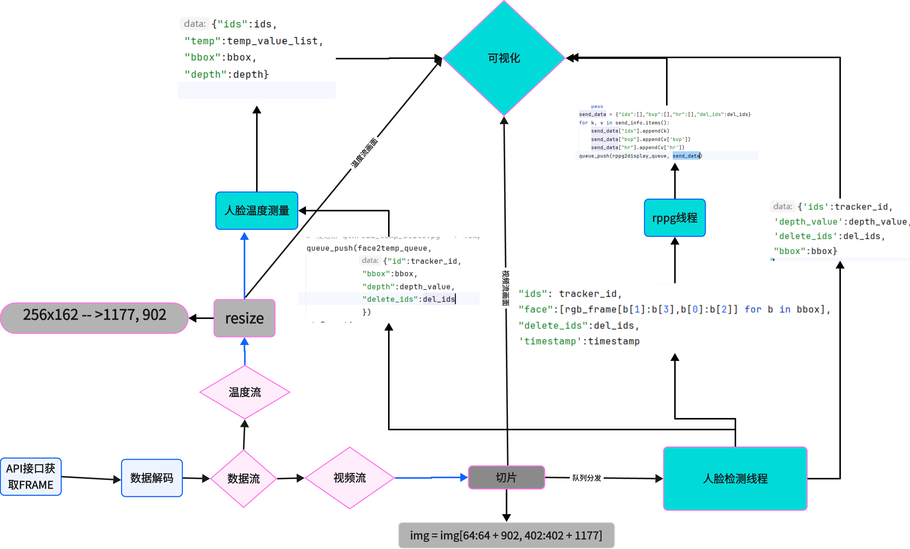
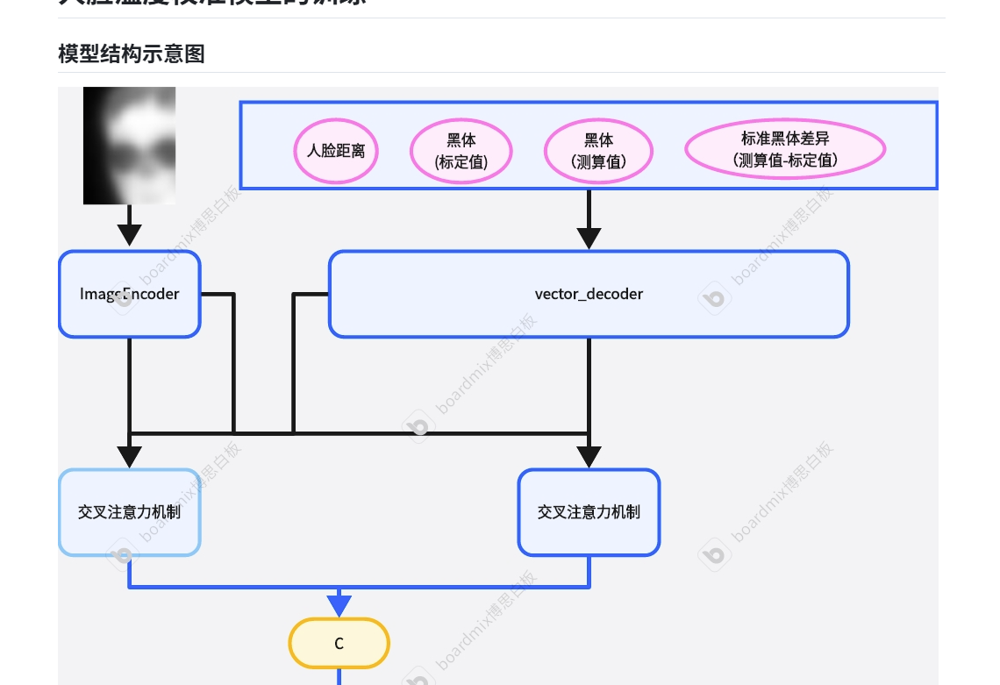

# 项目背景
计划开发一款非接触式（5M）的生理指标检测硬件，主要是体温和心率，期望体温温差在0.2℃心率的MAE<5次/分钟。

# 项目难点
1、产品画像： 从0开始研发集成，目前市面上无太多现成的可参考产品，并且很多之前疫情
2、算法难度： 因为是新研发的产品算法方面有以下几个难点：
- 软件框架：数据流怎么走，架构怎么定。
- 心率检测：RPPG模型哪些比较好、哪个更加的适合、数据怎么来。
- 温度测算：温度怎么测、数据怎么采集（怎么去找那么多的温度异常的）、模型怎么设计（模型架构、模型输入、模型输出）、MINI黑体怎么用起来

# 工作内容
硬件选型+双光数据对齐+模型设计+模型训练+模型推理+框架搭建

## 硬件选型
硬件由于需要测试温度因此只能选择双光相机（自带了RGB和红外镜头），市面选项多家后选择北京一家双光镜头厂家。
最复杂的是黑体的选择，可查找的厂家几乎都是大体量的黑体，而一体式需要MINI的黑体。

## RGB和TEMP流空间对齐
拿到设备后第一步的工作就是要将2个流的数据进行空间对齐，并且由于不清楚两个镜头是否是完全的真实的图幅对应，做了挺多的测试，最后发现只需要单纯的resize+crop即可实现对齐。

## 工作流设定
整个工作流做了几次优化最后敲定如下

## 模型设计

### 心率检测

使用可见光进行心率检测的手段是RPPG（Remote Photoplethysmography 远程光电容积脉搏波描记法）进行测量，​ 一般有直接进行心率HR回归的，但是更多的是做BVP然后利用BVP计算心率。

横向对比了多款RPPG测量模型（使用了开源的一个仓库rPPG-Toolbox），使用它进行相应的数据训练，这里的数据使用的自己采集的数据集（为了匹配摄像头），尝试过官方的数据权重，会导致模型效果较差。

最后选中了效果和速度都较为不错的EfficientPhys和TS-CAN 进行了更多数据的train，最终EfficientPhys的效果要整体优于TS-CAN。

使用YOLO进行人脸检测后，利用DeepSort进行跟踪检测，并且将每一帧的信息发送给RPPG模块进行检测，并将最后的数据发送给可视化模块进行绘制。

### 体温测量
体温测量模块相对工作较多,前置条件需要一个深度估计模块，其次还要包含数据采集（采集方式优化）、模型设计、模型训练。
#### 深度估计模块
经过测验，红外镜头的温漂不能按照传统的方法进行校准，传统的方法中黑体距离测试人很近，因此直接作差校正就可以有较高的精度，但是现在黑体和相机镜头距离越10cm，这会导致温度漂移巨大，因此距离对应的偏移需要进行建模，正因如此，每个人的距离是要进行测距的。
1、走过一些弯路，开始想着做类似双目测距的标定，后面发现路线走不通（标定复杂、实际工作时精度低）；然后有尝试深度学习相关的单目深度估计，但是这种通常需要一个标定，并且很不稳定，受背景影响很大，距离跳动很大；最后尝试最简单的 直接用 **单目测距公式（人脸宽度法）**

**已知参数：**
- $W$：真实人脸宽度（默认 **15 cm**）
- $P$：图像中人脸像素宽度
- $f$：相机焦距（像素单位）
- $d$：目标实际距离

**几何关系：**
$$
\frac{W}{P} = \frac{d}{f}
$$

**推导公式：**
$$
d = \frac{f \cdot W}{P}
$$

---

**示例：**
若 $f = 800\,\text{px}$，$W = 0.15\,\text{m}$，测得 $P = 300\,\text{px}$：
$$
d = \frac{800 \times 0.15}{300} = 0.4\,\text{m}
$$

实测时 通过多个人脸进行标定出f，然后假定人脸宽度为15cm，并且根据人脸的高宽比例进行相应的深度放缩，此方法相对来说人脸的box只要不突变，深度值基本不变，最后测试的深度精度在10cm左右。

### 模型设计

#### 数据采集

体温数据采集不似普通的数据采集，存在以下几个难点：
- 正常的体温好找、异常体温难找（最难）。
- 由于没有相关的研究，模型究竟怎么搭建，需要采集那些数据都不知道，因此采集哪些数据也是一个难题
  
因为第二个原因的存在，因此采集数据时就将温度流的box剪切保存，命名为对应的指标(深度 box 体温，黑体信息)。其实最开始没有保存温度流的矩阵数据，只是保留了$box.max()$，利用类似MLP的模型进行推理，但是后面发现精度一直上不去，并且这样也不是很合理，后期改成的多模态的 IMAGE+ 对应指标输入。

**模型输出敲定**
最开始的方案是直接暴力建模，把所有的信息纠结了怎么表示温度，但是这会导致一个问题，当数据集中存在了大量的36.8附近的值时，模型会学习怎么把所有数据都拟合到正常温度，这与初衷不符合。

**解决方案**
模型不在进行温度直接回归，使用以下公式进行拟合，模型不在只输出36.8附近的值，而是预测box最大值的bias
$$
box.max（）+bias --> reall
$$

这样子模型就是模型回归的是偏执，不再是一个恒定的36.8附近的值（因为不同深度不同位置的$box.max()$ 都不一致，因此对应的bias都不一样。

**仿造数据**

现场去医院架起仪器进行数据采集很不方便也很那实现。因此是自己制造数据。通过冰敷之后，马上测量温度后，采集几秒钟就可以获取到对应的数据，极大的提升数据获取的效率。

最后共计获取到了40W条数据。
#### 模型设计
输出敲定了是预测bias，最开始数据较少时（5W左右）使用MLP和传统的机器学习方法（RF、SVM等），其指标最终的Mean~MAE~只能下降到0.004，Max~MAE~还是在4左右，并不满足设计，因此又设计了一个多模态的模型。

经过了1000epoch后，模型损失约Mean~MAE~ = 0.000035，最大在Max~MAE~->0.5 

#### 其他优化
- 数据采集优化，采集大量数据后发现采集时就需要进行一些过滤，如 面部像素低于N的过滤、高宽过小的过于、高宽比过小/大的过滤
- 模型的输入优化，经过深入研究后发现图像的额头部分对于温度的影响最大，后面估计应该是数据采集的问题导致部分时候下半部分脸有点不一样。
- 输出温度优化，最开始使用均值、中值 但是波动都特别大，后面设计了一种 计算数据方差的滤波方式，利用 队列中50%的方差最小的数据的均值代表测试温度，以此输出温度才算彻底稳定不乱跳。
- 